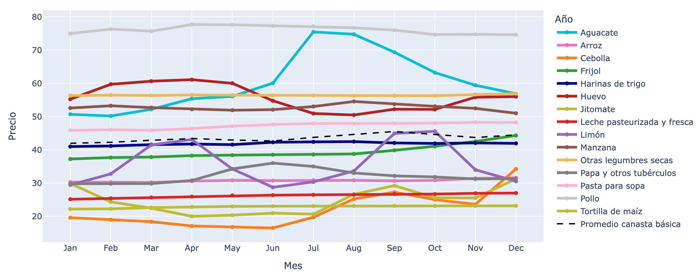
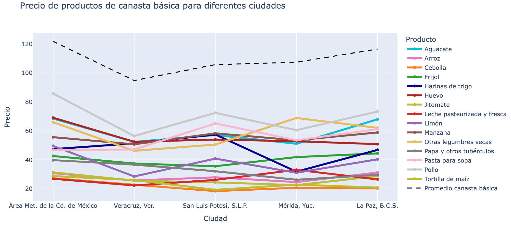
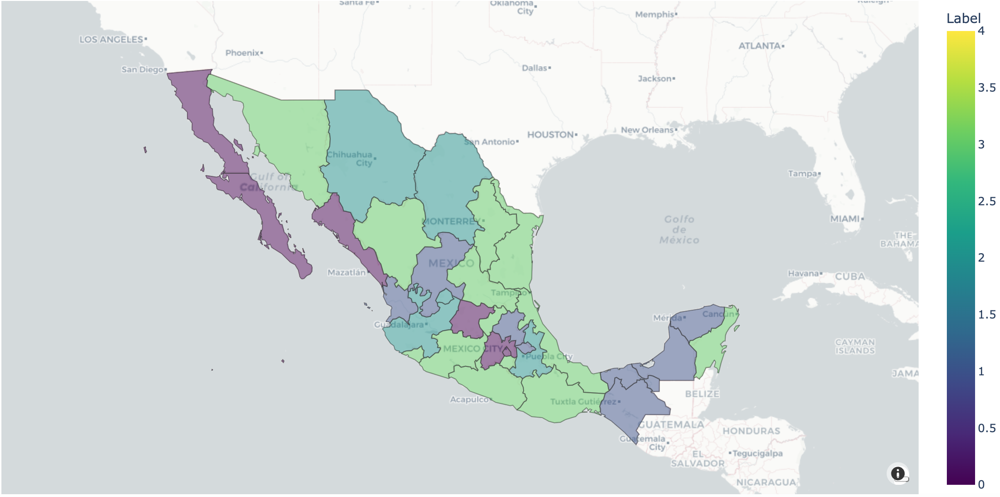

---

# 🌮 Mexican Food Basket Analysis

Welcome to the Mexican Food Basket Analysis project! This repository contains a comprehensive analysis of the Mexican food basket, exploring various aspects such as price trends and regional variations. Dive into the data to uncover insights about the food consumption patterns in Mexico.

Check the interactive notebook with nbviewer: https://nbviewer.org/github/sergio-alberto-dlm/mexican_food_basket_analysis/blob/main/mexican_food_basket_analysis.ipynb 

## 📄 Overview

This project aims to provide an in-depth analysis of the Mexican food basket using data visualization and statistical techniques. The analysis is conducted using Python and various data science libraries, and it covers multiple dimensions of the food basket, including:

- Price trends over time
- Nutritional content
- Regional variations
- Correlation analysis

## 🛠️ Tools and Libraries

The analysis utilizes the following tools and libraries:

```python
import pandas as pd
import numpy as np
import matplotlib.pyplot as plt
import seaborn as sns
import plotly.express as px
from sklearn.linear_model import LinearRegression
from statsmodels.tsa.seasonal import seasonal_decompose
```

## 📊 Data Analysis

### 1. Price Trends

We start by analyzing the price trends of various food items over time. This helps in understanding the inflation rate and the economic factors affecting food prices.


*Figure 1: Price Trends of Selected Food Items*


### 3. Regional Variations

We also analyze the regional variations in food prices and consumption patterns. This helps in understanding how different regions in Mexico are affected by economic and cultural factors.


*Figure 3: Regional Variations in Food Prices*

### 4. Clustering per states 

Finally, we conduct clustering process were we realize that nearby states tend to have a similar on average price of the food basket, despite the model has any knowledge of the geography.


*Figure 4: Clustering per states*

## 🔍 Key Findings

- **Price Trends**: Significant inflation observed in staple food items over the last decade.
- **Nutritional Content**: High carbohydrate intake with lower than recommended protein levels.
- **Regional Variations**: Notable differences in food prices and consumption patterns across different regions.
- **Correlation Analysis**: Strong correlations between economic indicators and food prices.


## 📚 References

1. Source of data and any relevant literature or datasets used in the analysis.

---